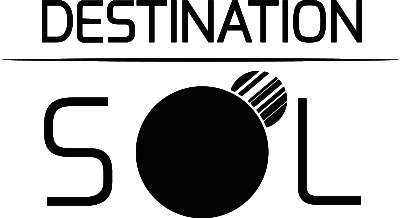

This is the official open source home for the arcade space shooter Destination Sol, originally started by Milosh Petrov and a small team on [Steam](http://store.steampowered.com/app/342980/) and [SourceForge](http://sourceforge.net/projects/destinationsol)

After receiving highly positive reviews launching as an indie title on Steam Milosh and the remaining team members wanted to focus on different projects, having made Destination Sol primarily to try out the involved technology.

A call was put out to the player community for a new maintainer, and open source was an option praised by many and already somewhat in place on Sourceforge. The open source group MovingBlocks behind [Terasology](http://terasology.org) stepped in to offer infrastructure and maintenance.

Milosh accepted our offer and supported us in moving the game onwards to its new home here on GitHub where we'll set up to accept contributions from anybody willing to help improve Destination Sol and expand on its gameplay.

Destination Sol is now officially licensed under the [Apache 2.0 License](http://www.apache.org/licenses/LICENSE-2.0.html) (except soundtrack, see its section below) and available in source code form at [GitHub](https://github.com/MovingBlocks/DestinationSol).

You can download the game on [Steam](http://store.steampowered.com/app/342980/), get it in the [Google Play Store](https://play.google.com/store/apps/details?id=com.miloshpetrov.sol2.android) or on [F-Droid](https://f-droid.org/packages/com.miloshpetrov.sol2.android/), or download the [very latest version from our build server](http://jenkins.terasology.io/teraorg/job/DestinationSol/job/engine/job/develop/lastSuccessfulBuild/artifact/desktop/build/distributions/DestinationSol.zip) (warning: latest build may be unstable)

Feel free to fork the project and contribute pull requests! You can visit a [Destination Sol forum](http://forum.terasology.org/forum/destination-sol.57/) on the Terasology site if you have any questions or would like to discuss the game or contributing.

Gameplay
--------

You start at the edge of a solar system as a pilot in a small ship. You are free to explore space, land on planets, fight with enemies, upgrade your ship and equipment, hire mercenaries, mine asteroids, and so on.

Enemy ships are orange icons, allies are blue. Enemies can be marked with a skull icon - beware! They are likely stronger than you. Improve your ship and equipment and fight them later!

Your ship has a certain number of hit points (your armor), which will recover if you have consumable repair kits in your inventory and stay idle for a short while. You may also have a shield that takes damage first. Each is vulnerable to different weapons, both on your ship and others.

Weapons and special abilities often need consumables to function (like Bullets or Slo Mo Charges) and take time to rearm.

You can destroy asteroids for easy money, even with the starting ship's ammo-less but weak gun.

Warnings get posted if you get close to dangerous ships or may soon collide with something on your current course. Blue dots along the edge of the screen indicate a planet is nearby.

Watch out about buying a new ship if you can only barely afford it - you might need to buy new compatible weaponry too!

Mercenaries will follow you around and should start with a compatible weapon again in v1.4.1. They'll pick up items as well and keep them, greedy little buggers! But then they drop everything again on death, so ...

Controls
--------

Note: You can select either pure keyboard, keyboard + mouse, or controller (in the settings). Exact details may change over time. Below are the default key mappings (no mouse). You can change these in-game.

*Main screen*

* [Space] - Fire main gun
* [Ctrl] - Fire secondary gun (if equipped)
* [Shift] - Use ship ability
* [Left,Right] - Turn the ship
* [Up] - Thrust. There are no brakes! You have to turn and burn to change direction or slow down
* [Tab] - Show the map
* [I] - Show inventory
* [T] - Talk (interact with a station)
* [ESC] - Menu / close screens

*With map up*

* [Up, Down] - Zoom in and out on the map

*With inventory up*

* [Left, Right] - change page
* [Page Up, Page Down] - scroll up and down
* [Space] - equip / unequip item *OR* buy / sell if talking to a station
* [D] - discard selected item

Building and running from source
--------

You only need Java 11 installed to run Destination Sol from source.

Run any commands in the project root directory (where you cloned / extracted the project to, using a command prompt / terminal).

* Download / clone the [source from GitHub](https://github.com/MovingBlocks/DestinationSol)
* To run from the command line: `gradlew run` (on Linux you might need to use `./gradlew run`)
* IntelliJ should import the project automatically when you open the project directory
* Distributions (Windows, Linux, Mac) can be created locally by running: `gradlew distZipBundleJREs`

For Android a little extra setup is needed. See instructions [here](https://github.com/MovingBlocks/DestSolAndroid).

[Steam Release Process](steam/SteamRelease.md)
------------

Contributors
------------
[GitHub contribution stats](https://github.com/MovingBlocks/DestinationSol/graphs/contributors)
[Contribution Leaderboard](http://destinationsol.org/contribute)

* Original creators: [Milosh Petrov](https://github.com/miloshpetrov), [Nika Burimenko](https://github.com/NoiseDoll), Kent C. Jensen, Julia Nikolaeva

* Contributors on GitHub: [Cervator](https://github.com/Cervator), [Rulasmur (PrivateAlpha)](https://github.com/Rulasmur), [theotherjay](https://github.com/theotherjay), [LinusVanElswijk](https://github.com/LinusVanElswijk), [SimonC4](https://github.com/SimonC4), [grauerkoala](https://github.com/grauerkoala), [rzats](https://github.com/rzats), [LadySerenaKitty](https://github.com/LadySerenaKitty), [askneller](https://github.com/askneller), [JGelfand](https://github.com/JGelfand), [AvaLanCS](https://github.com/Avalancs), [scirelli](https://github.com/scirelli), [Sigma-One](https://github.com/Sigma-One), [vampcat](https://github.com/vampcat), [Malanius](https://github.com/Malanius), [AonoZan](https://github.com/AonoZan), [ererbe](https://github.com/ererbe), [SurajDutta](https://github.com/SurajDuta), [jasyohuang](https://github.com/jasyohuang), [Steampunkery](https://github.com/Steampunkery), [Graviton48](https://github.com/Graviton48), [Adrijaned](https://github.com/Adrijaned), [MaxBorsch](https://github.com/MaxBorsch), [sohil123](https://github.com/sohil123), [FieryPheonix909](https://github.com/FieryPheonix909), [digitalripperynr](https://github.com/digitalripperynr), [NicholasBatesNZ](https://github.com/NicholasBatesNZ), [Pendi](https://github.com/ZPendi), [Torpedo99](https://github.com/Torpedo99), [AndyTechGuy](https://github.com/AndyTechGuy), [BenjaminAmos](https://github.com/BenjaminAmos), [dannykelemen](https://github.com/dannykelemen), [msteiger](https://github.com/msteiger), [oniatus](https://github.com/oniatus), [arpitkamboj](https://github.com/arpitkamboj), [manas96](https://github.com/manas96), [IsaacLic](https://github.com/IsaacLic), [Mpcs](https://github.com/Mpcs), [ZPendi](https://github.com/ZPendi), [nailorcngci](https://github.com/nailorcngci), [FearlessTobi](https://github.com/FearlessTobi), [ujjman](https://github.com/ujjman), [ThisIsPIRI](https://github.com/ThisIsPIRI), [Esnardo](https://github.com/Esnardo), [IsaiahBlanks](https://github.com/IsaiahBlanks), [DarkWeird](https://github.com/DarkWeird), [Mystic-Slice](https://github.com/Mystic-Slice), [superusercode](https://github.com/superusercode), [AdamJonsson](https://github.com/AdamJonsson), [sagarg22](https://github.com/sagarg22), [jankeromnes](https://github.com/jankeromnes)
... and your name here? :-) More coming!

* Soundtrack - Provided by [NeonInsect](https://github.com/NeonInsect) ([Soundcloud](https://soundcloud.com/neon-insect)) and copyrighted by him [CC-NC 4.0](https://creativecommons.org/licenses/by-nc/4.0/), free for our use with Destination Sol.
* All sprites from MillionthVector are licensed under a Creative Commons Attribution 4.0 International License - originally reachable at millionthvector.blogspot.id

Apologies in advance for any omissions, contact [Cervator](http://forum.terasology.org/members/cervator.2/) if you believe you've been missed :-)
